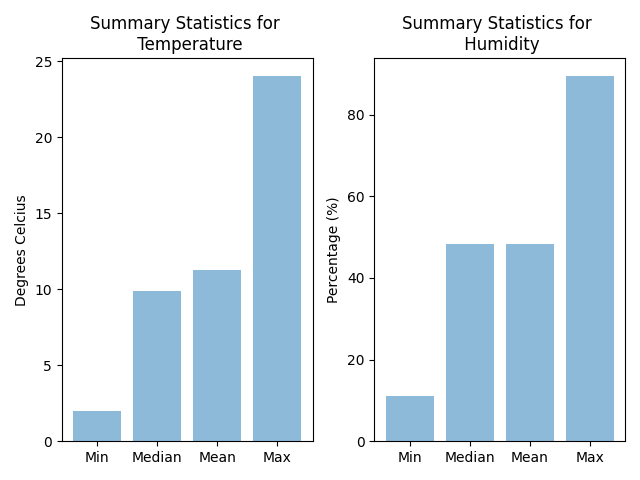

# Weather RESTful API

## Notes on how to use API

This is a Flask-based API for querying weather data for a given city and period. In order to obtain weather data, the Virtual Crossing Weather API is used (https://www.visualcrossing.com/weather-api). 


### Endpoints

#### 1. /weather

For accessing the min, max, average and median temperature and humidity for the given city and period of time.

##### Arguments:

1. **city**: The city that you would like the weather summary for.
2. **period**: The period of time to be considered in the form: <START_DATE>|<END_DATE>, with the following time formatting: %Y-%m-%d, for each of the dates.

Using these arguments, the general form of the requests are as follows:

##### Running locally:
```
http://127.0.0.1:5000/weather?city=<CITY>&period=<START_DATE>|<END_DATE>
```
Here is an example request:
```
http://127.0.0.1:5000/weather?city=Johannesburg&period=2019-08-01|2019-09-05
```

##### Running deployed app (hosted on Heroku):
```
https://flask-weather-api-app.herokuapp.com/weather?city=<CITY>&period=<START_DATE>|<END_DATE>
```
Here is an example request:
```
https://flask-weather-api-app.herokuapp.com/weather?city=Johannesburg&period=2019-08-01|2019-09-05
```


If the request is succesful, the returned results are the min, max, average and median temperature and humidity for the given city and period of time in json format. Here is an example output:

```
{"average_humidity":74.62,
 "average_temp":20.08,
 "max_humidity":91.06,
 "max_temp":29.9,
 "median_humidity":80.31,
 "median_temp":18.9,
 "min_humidity":37.71,
 "min_temp":15.1}
```


#### 2. /weather/bar

For generating bar charts displaying the min, max, average and median temperature and humidity for the given city and period of time.

##### Arguments:

1. **city**: The city that you would like the weather summary for.
2. **period**: The period of time to be considered in the form: <START_DATE>|<END_DATE>, with the following time formatting: %Y-%m-%d, for each of the dates.

Using these arguments, the general form of the requests are as follows:

##### Running locally:
```
http://127.0.0.1:5000/weather/bar?city=<CITY>&period=<START_DATE>|<END_DATE>
```

Here is an example request:
```
http://127.0.0.1:5000/weather/bar?city=Johannesburg&period=2019-08-01|2019-09-05
```

##### Running deployed app (hosted on Heroku):
```
https://flask-weather-api-app.herokuapp.com/weather/bar?city=<CITY>&period=<START_DATE>|<END_DATE>
```

Here is an example request:
```
https://flask-weather-api-app.herokuapp.com/weather/bar?city=Johannesburg&period=2019-08-01|2019-09-05
```


If the request is succesful, the returned result is a two bar charts displaying the min, max, average and median temperature and humidity, respectively, for the given city and period of time. Here is an example:



## Limitations due to Virtual Crossing

As the API made use of the free Virtual Crossing API plan, there are daily request limits (250) and there are also limits on the results per query (100). To handle the latter, we used their ```aggregateHours``` parameter. When this parameter is set to 1, the data returned is hourly data; when it is set to 2, the hourly data is aggregated to two-hourly data; and so on...
In order to implement this we used the following lines of code:
```
aggregator = 1                                                         # hourly data
num_obs = get_num_obs(start, end, aggregator)                          # results per query
    while num_obs > 100:                                               # while too many results per query
        if aggregator == 24:
            return 'Period is too long for Weather Crossing API.', 1  
        aggregator += 1                                                # increase aggregation level
        num_obs = get_num_obs(start, end, aggregator)                  # recalculating results per query
```
where ```aggregator``` is then used as their ```aggregateHours``` parameter. Since the ```aggregateHours``` parameter can have a maximum value of 24, it means that you cannot request data for a period of longer than 100 days.
